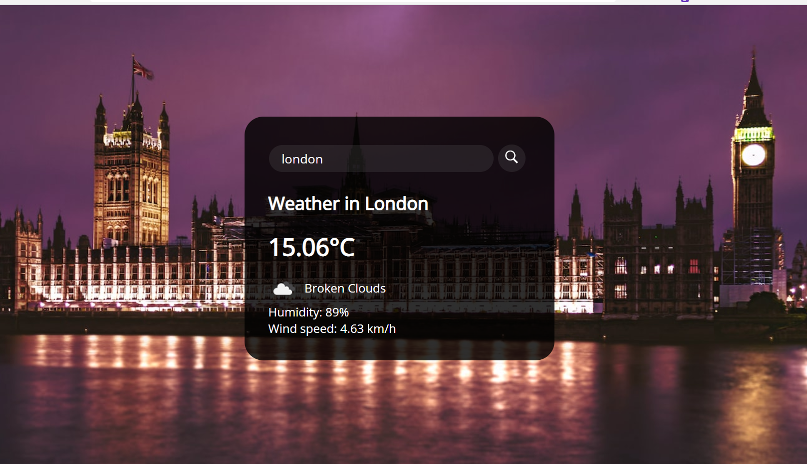

# WeatherAppNXT

Welcome to WeatherAppNXT!

## Introduction

WeatherAppNXT is a user-friendly weather application that provides real-time weather updates and forecasts for locations worldwide.

[Demo](https://weatherappnxt.netlify.app/)

## Features

- **Current Weather:** Instant access to current weather conditions.

- **Search:** Easily find weather details for different cities.
- **Responsive:** Works well on desktop and mobile devices.

## Getting Started

- No installation needed. Visit [WeatherAppNXT](https://weatherappnxt.netlify.app).
- Explore current weather, hourly, and 5-day forecasts.
- Use the search bar to find weather for specific cities.

## Contributing

WeatherAppNXT is open-source! Check [Contribution Guidelines](CONTRIBUTING.md).

## Contact

For questions, contact us at support@weatherappnxt.netlify.app.

Thank you for using WeatherAppNXT!
